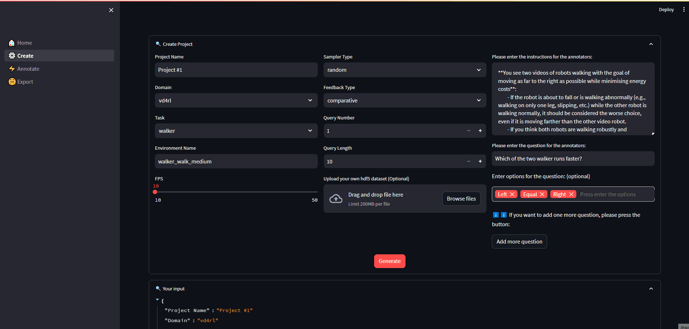
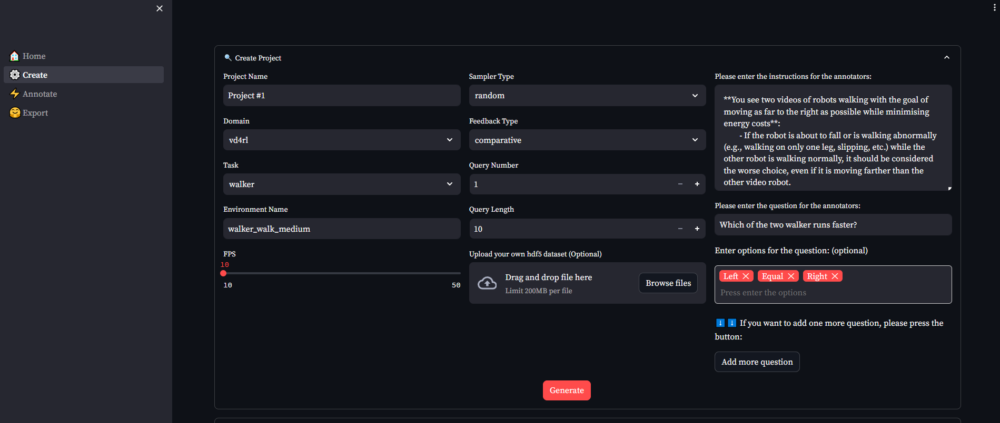
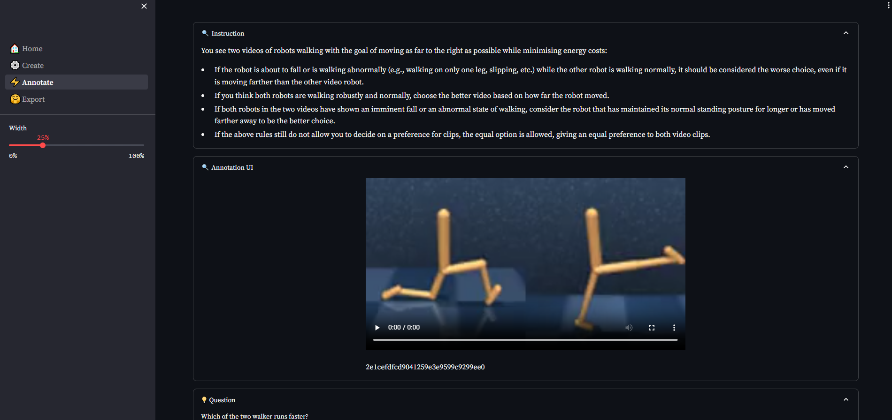
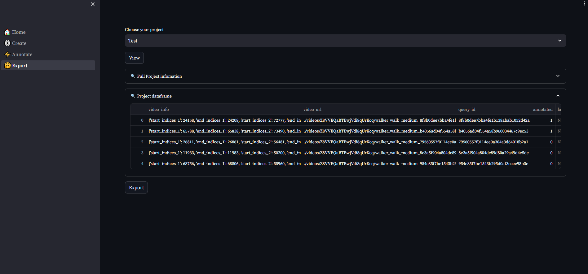

# 🚀 Mini-Uni-RLHF

Mini-Uni-RLHF is **minimal out-of-the-box annotation tool** for researchers in RLHF community, powered by [streamlit](https://streamlit.io/). The library only contains the core functionality of Uni-RLHF platform, which is designed with a focus on **simple over easy**. We recommend this version for researchers and small tasks that require **no heavy configuration to achieve a complete workflow**!

<p align="center">
    <br>
    
    <br>
<p>

## Feature

- Out of the box, no heavy configuration required  
- Easily scalable based on streamlit framework and universal dataset format 

## 🎯 Roadmap

- [ ] Enrich documentation
- [ ] Add visual and keypoint feedback support
- [ ] Add online RL training mode

## 🛠️ setup

Install dependencies in **less than 30 seconds**:   
```bash
cd /path/to/Mini-Uni-RLHF
pip install -r requirements.txt
```
Using test datasets:  
- Download datasets in [Google Drive](https://drive.google.com/file/d/1ysBaB-BsgGLTDK3YNgGQqldeBs7jVbCl/view?usp=sharing)   
- Move `0_walker_walk_medium.hdf5` to default dataset location:  
```bash
cd /path/to/Mini-Uni-RLHF
mkdir -p datasets/dataset_resource/vd4rl/walker/walker_walk_medium/
```

😎 Enjoy the mini tool!
```bash
streamlit run main.py
```

## 📂 Customised datasets

### How to use existed datasets

We provide a very small walker dataset in `Mini-Uni-RLHF/datasets/dataset_resource/vd4rl/walker/walker_walk_medium/0_walker_walk_medium.hdf5` for users to test. And now we suppoert `d4rl`, `atari`, `smarts` and `vd4rl` domain. (TODO)

### How to add new datasets

All you need to do to plug into the new dataset is write a python file named `{$mode}_{$domain}.py` like `offline_atari` and the corresponding few functions! See details at `Mini-Uni-RLHF/datasets/offline_customization_dataset.py`.  

```python
class BaseOfflineDataset(object):
    def __init__(self):
        
    def load_offline_dataset(self):
        
    def get_episode_boundaries(self):
    
    def sample(self):
        
    def visualize(self):
        
    def query(self):

```

## 📸 Screenshot

- Create the project:
<p align="center">
    <br>
    
    <br>
<p>

- Annotate labels for the project:
<p align="center">
    <br>
    
    <br>
<p>

- Export the annotated dataset:
<p align="center">
    <br>
    
    <br>
<p>

## 🏷️ License

Distributed under the MIT License. See `LICENSE.txt` for more information.

## ✉️ Contact

For any questions, please feel free to email yuanyf@tju.edu.cn.

## 📝 Citation

If you find our work useful, please consider citing:
```
@inproceedings{anonymous2023unirlhf,
    title={Uni-{RLHF}: Universal Platform and Benchmark Suite for Reinforcement Learning with Diverse Human Feedback},
    author={Yuan, Yifu and Hao, Jianye and Ma, Yi and Dong, Zibin and Liang, Hebin and Liu, Jinyi and Feng, Zhixin and Zhao, Kai and Zheng, Yan}
    booktitle={The Twelfth International Conference on Learning Representations, ICLR},
    year={2024},
    url={https://openreview.net/forum?id=WesY0H9ghM},
}
```